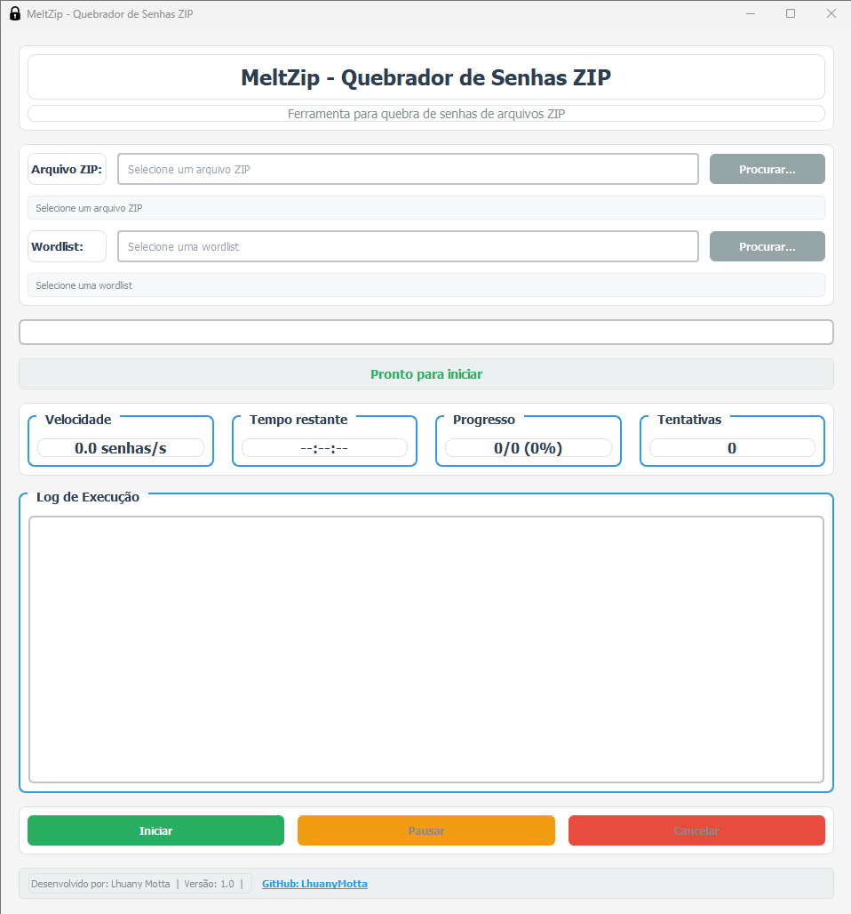
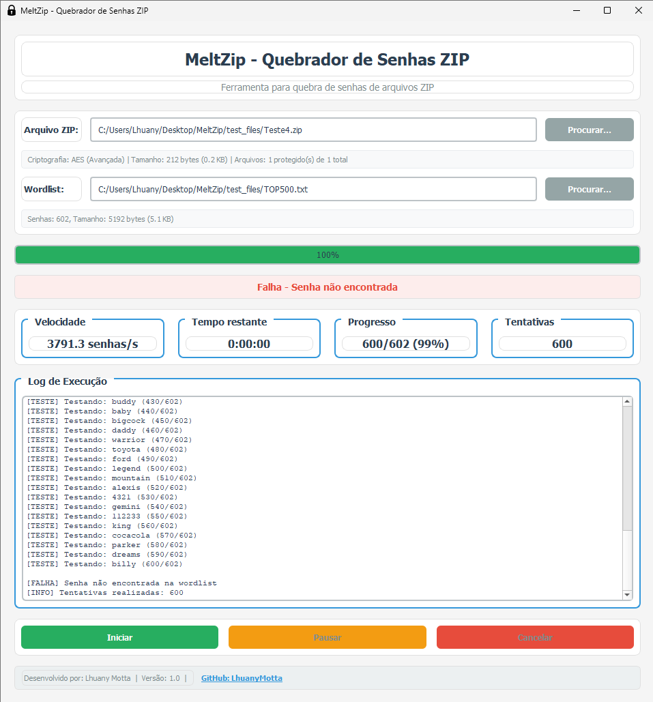

# MeltZip - Quebrador de Senhas ZIP

Ferramenta avançada para quebra de senhas de arquivos ZIP com suporte a **AES** e **ZipCrypto**.

---

## 📥 Baixar o MeltZip

```bash
git clone https://github.com/seu-usuario/MeltZip.git
cd MeltZip
```

---

## 📦 Instalar dependências

```bash
pip3 install -r requirements.txt
```

---

## 📌 Instalação

### Pré-requisitos

* Python **3.6+**
* `pip` (gerenciador de pacotes Python)

### 🔹 Instalação no Linux

1. **Instalar Python e pip**:

   ```bash
   sudo apt update
   sudo apt install python3 python3-pip
   ```

2. **Instalar dependências**:

   ```bash
   pip3 install -r requirements.txt
   ```

---

### 🔹 Instalação no Windows

1. **Instalar Python**:
   Baixe do site oficial: [python.org/downloads](https://www.python.org/downloads/)

   > ⚠️ Marque a opção **"Add Python to PATH"** durante a instalação.

2. **Baixar o MeltZip**:
   Faça download ou clone o repositório e extraia para uma pasta.

3. **Instalar dependências**:

   * Abra o **Prompt de Comando** ou **PowerShell**
   * Navegue até a pasta do MeltZip:

     ```bash
     cd C:\caminho\para\MeltZip
     ```
   * Instale as dependências:

     ```bash
     pip install -r requirements.txt
     ```

---

## 📁 Estrutura do Projeto

```
MeltZip/
├── meltzip_gui.py          # Interface gráfica
├── meltzip_cli.py          # Interface de linha de comando
├── requirements.txt        # Dependências
├── README.md               # Documentação completa
└── test_files/             # Arquivos de teste (opcional)
    ├── Arquivo_Secreto.zip
    ├── Arquivo_Secreto.zip
    └── TOP500.txt
```

---

## 🚀 Como Usar

### Interface Gráfica (GUI)

```bash
# Método 1 - Executar diretamente
python meltzip_gui.py

# Método 2 - Usar a CLI com opção --gui
python meltzip_cli.py --gui
```

**Passos para usar a GUI**:

1. Clique em **"Procurar..."** ao lado de **"Arquivo ZIP"** para selecionar um arquivo
2. Clique em **"Procurar..."** ao lado de **"Wordlist"** para selecionar a lista de senhas
3. Clique em **"Iniciar"** para começar o processo
4. Use **"Pausar"** para pausar e **"Cancelar"** para interromper
5. A senha encontrada será exibida quando descoberta

---

### Linha de Comando (CLI)

```bash
# Uso básico
python meltzip_cli.py arquivo.zip wordlist.txt

# Modo verboso (mais informações)
python meltzip_cli.py arquivo.zip wordlist.txt --verbose

# Ajuda
python meltzip_cli.py --help
```

**Exemplo**:

```bash
python meltzip_cli.py Arquivo_Secreto.zip TOP500.txt
```

---

## ✨ Funcionalidades

- ✅ Suporte a criptografia **AES** e **ZipCrypto**
- ✅ Interface gráfica moderna com **tema escuro**
- ✅ Interface de linha de comando **colorida**
- ✅ Detecção automática do tipo de criptografia
- ✅ Estatísticas em tempo real (**velocidade, tempo restante**)
- ✅ Pausa e continuação do processo
- ✅ Log detalhado de operações
- ✅ Informações detalhadas sobre arquivos ZIP e wordlists

---

## 🛠️ Resolução de Problemas

* **Erro:** `ModuleNotFoundError: No module named 'colorama'`

  ```bash
  pip install colorama
  ```

* **Erro:** `ModuleNotFoundError: No module named 'pyzipper'`

  ```bash
  pip install pyzipper
  ```

* **Erro:** `ModuleNotFoundError: No module named 'PyQt5'`

  ```bash
  pip install PyQt5
  ```

---

## 📝 Exemplos de Wordlists

* **TOP500.txt** → As 500 senhas mais comuns
* **rockyou.txt** → Lista extensa de senhas (baixe separadamente)
* **Custom wordlist** → Crie sua própria lista de senhas

---

## 📷 Imagens da Aplicação

> 💡 *Demonstrativo do MeltScan*





---

## ⚠️ Considerações Legais

Esta ferramenta é fornecida apenas para fins **educacionais e de teste de segurança**.
Certifique-se de ter **permissão adequada** antes de usar o MeltZip em qualquer arquivo ZIP.

---

## 🙋‍♀️ Autoria

Desenvolvido por: **Lhuany Motta** [🔗 GitHub](https://github.com/LhuanyMotta)
Versão: 1.0

---

## 📄 Licença

Este projeto está sob a licença **MIT**.